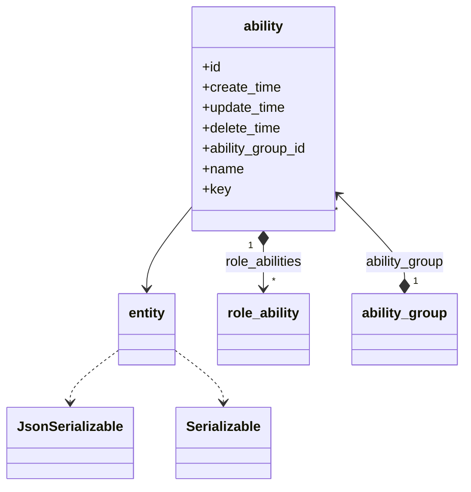
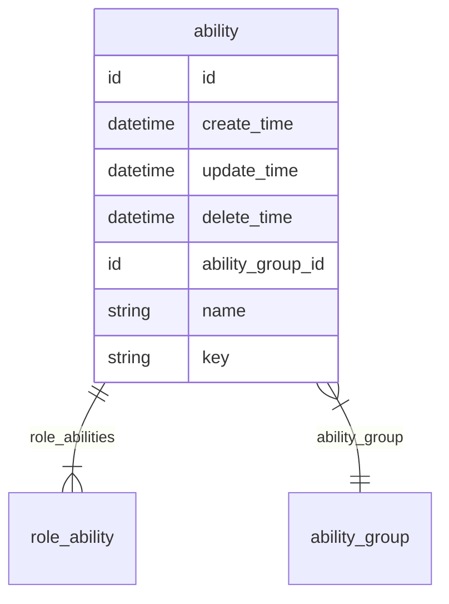

# 能力  
能力

### 关联关系  

与能力相关的类图:  

相关的 `E-R` 图:  

### 实体属性

这里是指能力在编码过程中可以被直接调用的属性，其中 `必要` 是指在能力创建时，是否必须要有的属性，可选属性可在创建能力后再赋值。  
**属性表:**   

|属性键名|数据类型|必要|名称|描述|
|----|----|----|----|----|
|id|id|无需|主键|主键会自动生成，无需赋值|
|create_time|datetime|无需|创建时间|会自动生成，无需赋值|
|update_time|datetime|无需|更新时间|会自动更新，无需赋值，创建时与 `create_time` 一致|
|delete_time|datetime|无需|删除时间|会自动维护，无需赋值|
|role_abilities|[role_ability](entity/role_ability.md)|可选|关联关系|能力拥有的角色能力关系，是包含 `role_ability` 的数组|
|ability_group|[ability_group](entity/ability_group.md)|必传|关联关系|能力所属的能力分组|
|ability_group_id|id|无需|外键|能力所属的能力分组，此处为能力分组的`id`|
|name|string|必传|名称|名称|
|key|string|必传|标识|名称|

### 常量

