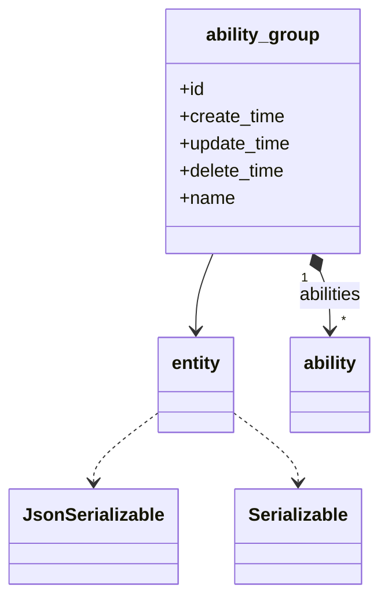
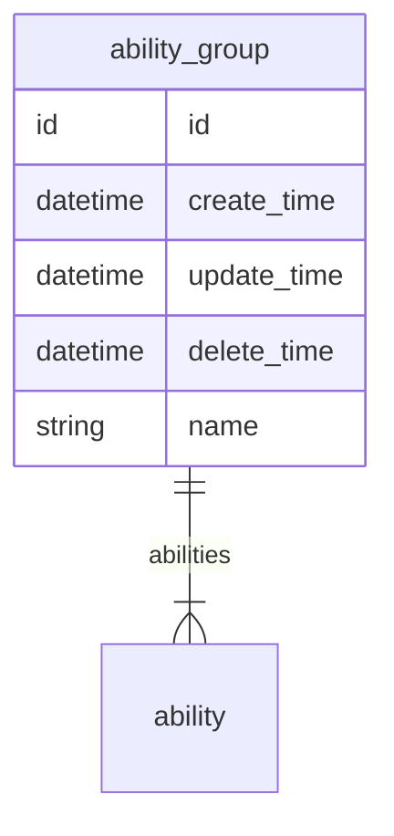

# 能力分组  
能力分组

### 关联关系  

与能力分组相关的类图:  

相关的 `E-R` 图:  

### 实体属性

这里是指能力分组在编码过程中可以被直接调用的属性，其中 `必要` 是指在能力分组创建时，是否必须要有的属性，可选属性可在创建能力分组后再赋值。  
**属性表:**   

|属性键名|数据类型|必要|名称|描述|
|----|----|----|----|----|
|id|id|无需|主键|主键会自动生成，无需赋值|
|create_time|datetime|无需|创建时间|会自动生成，无需赋值|
|update_time|datetime|无需|更新时间|会自动更新，无需赋值，创建时与 `create_time` 一致|
|delete_time|datetime|无需|删除时间|会自动维护，无需赋值|
|abilities|[ability](entity/ability.md)|可选|关联关系|能力分组拥有的能力，是包含 `ability` 的数组|
|name|string|必传|名称|名称|

### 常量

