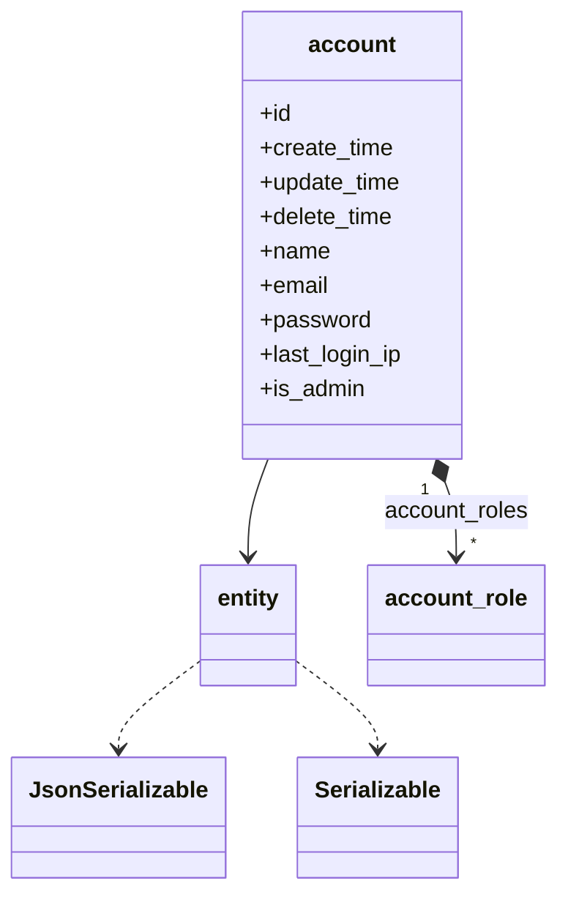
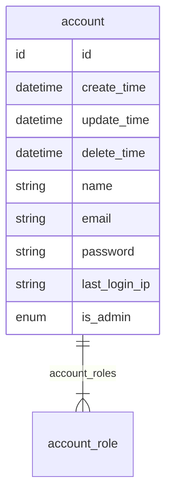

# 账号  
账号

### 关联关系  

与账号相关的类图:  

相关的 `E-R` 图:  

### 实体属性

这里是指账号在编码过程中可以被直接调用的属性，其中 `必要` 是指在账号创建时，是否必须要有的属性，可选属性可在创建账号后再赋值。  
**属性表:**   

|属性键名|数据类型|必要|名称|描述|
|----|----|----|----|----|
|id|id|无需|主键|主键会自动生成，无需赋值|
|create_time|datetime|无需|创建时间|会自动生成，无需赋值|
|update_time|datetime|无需|更新时间|会自动更新，无需赋值，创建时与 `create_time` 一致|
|delete_time|datetime|无需|删除时间|会自动维护，无需赋值|
|account_roles|[account_role](entity/account_role.md)|可选|关联关系|账号拥有的账号角色关系，是包含 `account_role` 的数组|
|name|string|必传|姓名|名称|
|email|string|必传|电子邮箱|电子邮箱|
|password|string|必传|密码|密码|
|last_login_ip|string|可选|最后登陆IP|IP 地址|
|is_admin|enum|必传|管理员|开关|

### 常量

属性 `is_admin` 相关的常量：  

|常量键名|常量值|常量含义|
|----|----|----|
|account::IS_ADMIN_1|1|账号管理员是|
|account::IS_ADMIN_||账号管理员否|

实体中提供的与这些变量相关的方法：  

|方法|作用|
|----|----|
|$account->get_is_admin_description()|获取账号的当前管理员的文字描述|
|$account->is_admin_is_1()|判断当前管理员是否是 `是`|
|$account->set_is_admin_1()|设置当前管理员为 `是`|
|$account->is_admin_is_()|判断当前管理员是否是 `否`|
|$account->set_is_admin_()|设置当前管理员为 `否`|

