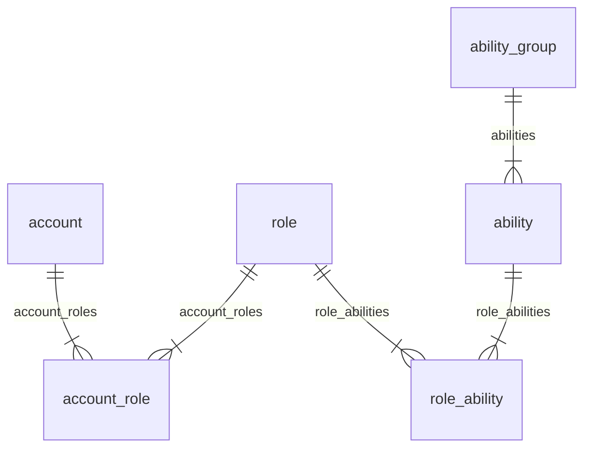

# 实体关联

这里展示整个项目的所有实体的 `E-R` 图:  

```mermaid
erDiagram
    account ||--|{ account_role : account_roles  
    role ||--|{ account_role : account_roles  
    role ||--|{ role_ability : role_abilities  
    ability ||--|{ role_ability : role_abilities  
    ability_group ||--|{ ability : abilities  
```
