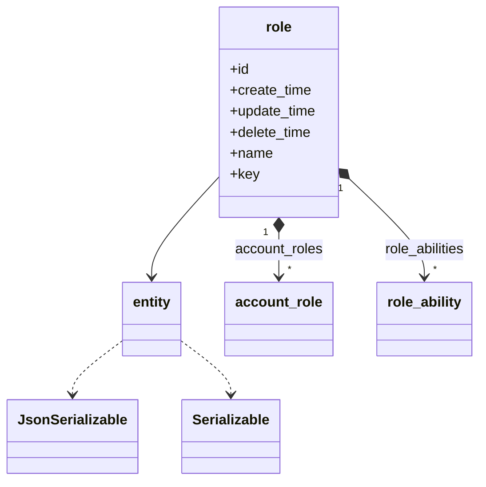
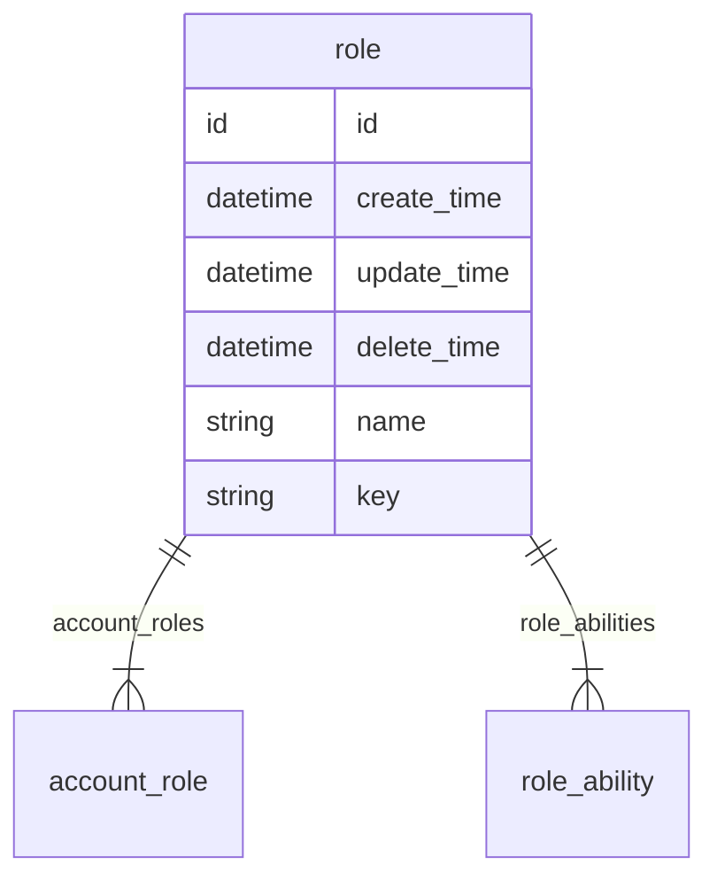

# 角色  
角色

### 关联关系  

与角色相关的类图:  

相关的 `E-R` 图:  

### 实体属性

这里是指角色在编码过程中可以被直接调用的属性，其中 `必要` 是指在角色创建时，是否必须要有的属性，可选属性可在创建角色后再赋值。  
**属性表:**   

|属性键名|数据类型|必要|名称|描述|
|----|----|----|----|----|
|id|id|无需|主键|主键会自动生成，无需赋值|
|create_time|datetime|无需|创建时间|会自动生成，无需赋值|
|update_time|datetime|无需|更新时间|会自动更新，无需赋值，创建时与 `create_time` 一致|
|delete_time|datetime|无需|删除时间|会自动维护，无需赋值|
|account_roles|[account_role](entity/account_role.md)|可选|关联关系|角色拥有的账号角色关系，是包含 `account_role` 的数组|
|role_abilities|[role_ability](entity/role_ability.md)|可选|关联关系|角色拥有的角色能力关系，是包含 `role_ability` 的数组|
|name|string|必传|名称|名称|
|key|string|必传|标识|名称|

### 常量

