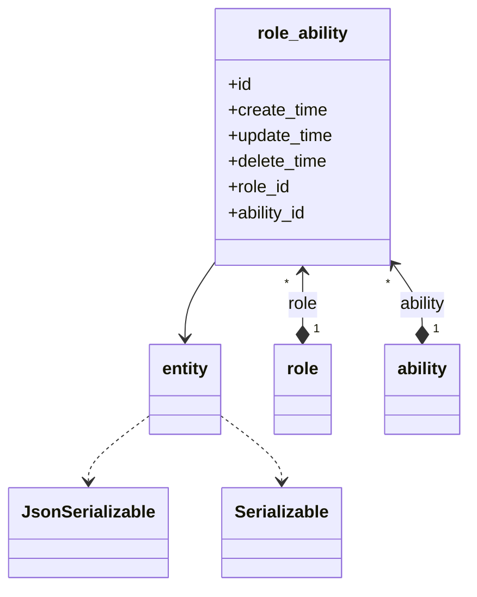
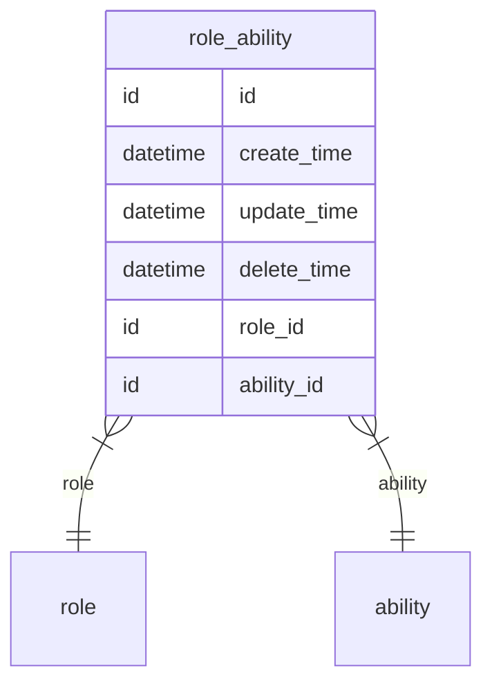

# 角色能力关系  
角色能力关系

### 关联关系  

与角色能力关系相关的类图:  

相关的 `E-R` 图:  

### 实体属性

这里是指角色能力关系在编码过程中可以被直接调用的属性，其中 `必要` 是指在角色能力关系创建时，是否必须要有的属性，可选属性可在创建角色能力关系后再赋值。  
**属性表:**   

|属性键名|数据类型|必要|名称|描述|
|----|----|----|----|----|
|id|id|无需|主键|主键会自动生成，无需赋值|
|create_time|datetime|无需|创建时间|会自动生成，无需赋值|
|update_time|datetime|无需|更新时间|会自动更新，无需赋值，创建时与 `create_time` 一致|
|delete_time|datetime|无需|删除时间|会自动维护，无需赋值|
|role|[role](entity/role.md)|必传|关联关系|角色能力关系所属的角色|
|role_id|id|无需|外键|角色能力关系所属的角色，此处为角色的`id`|
|ability|[ability](entity/ability.md)|必传|关联关系|角色能力关系所属的能力|
|ability_id|id|无需|外键|角色能力关系所属的能力，此处为能力的`id`|

### 常量

